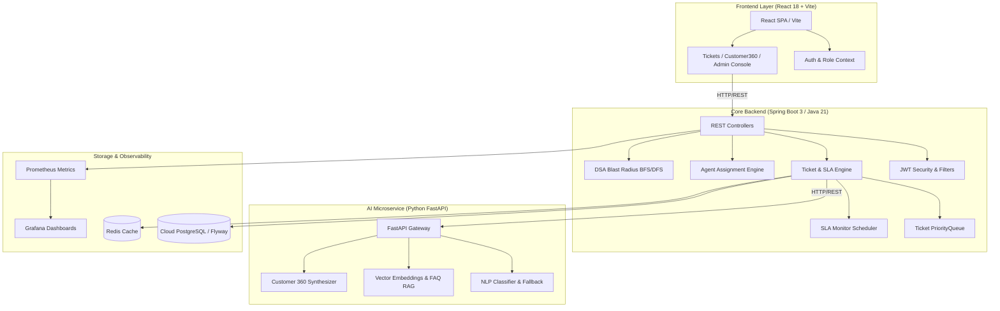

# 🚀 CloudPilot — Intelligent Support & SLA Management Platform

[](https://github.com/sangam-builds/cloudpilot/actions/workflows/ci.yml)
[](https://cloudpilot-frontend-qfbwl7ncz-sangams-projects-d081cefb.vercel.app/login)
[](LICENSE)
[](https://render.com/deploy?repo=https://github.com/sangam-builds/cloudpilot)
[](https://vercel.com/new/clone?repository-url=https://github.com/sangam-builds/cloudpilot&root-directory=frontend)
[](https://spring.io/projects/spring-boot)
[](https://fastapi.tiangolo.com)
[](https://react.dev)
[](https://www.postgresql.org)
[](https://www.docker.com)

> 🚀 **Live Demo**: [https://cloudpilot-frontend-qfbwl7ncz-sangams-projects-d081cefb.vercel.app/login](https://cloudpilot-frontend-qfbwl7ncz-sangams-projects-d081cefb.vercel.app/login)  
> *Instant 1-click access with pre-configured Admin, Support Agent, and Enterprise Customer accounts.*

**CloudPilot** is an enterprise-grade AI-powered customer support orchestration and dynamic SLA monitoring platform. It combines real-time NLP classification, semantic RAG draft reply generation, mathematical multi-factor agent scoring, Customer 360 intelligence, and microservice blast radius simulation into a unified dark-mode dashboard.

---

## 🌐 Live Demo & 1-Click Free Cloud Deployment

- 🔗 **Production Live Demo**: [https://cloudpilot-frontend-qfbwl7ncz-sangams-projects-d081cefb.vercel.app/login](https://cloudpilot-frontend-qfbwl7ncz-sangams-projects-d081cefb.vercel.app/login) (Try directly in browser with 1-click test roles).
- 🚀 **1-Click Render Blueprint**: [Deploy to Render](https://render.com/deploy?repo=https://github.com/sangam-builds/cloudpilot) (Instantiates FastAPI AI Service, Spring Boot Engine, and React SPA with Neon DB).
- ⚡ **Vercel / Netlify Frontend**: Point to the `frontend/` directory with `VITE_API_BASE_URL` set to your backend URL.
- 📖 **Complete Step-by-Step Guide**: See [docs/deployment.md](docs/deployment.md) for detailed platform-by-platform instructions.

---

## 🏛️ System Architecture



---

## 🌟 Key Features

1. **🤖 AI-Powered Real-Time Triage**: Automatically extracts categories, priority ratings (`HIGH`, `MEDIUM`, `LOW`), and sentiment tags (`POSITIVE`, `NEUTRAL`, `NEGATIVE`, `FRUSTRATED`) with seamless Java keyword fallback resilience.
2. **🧠 Grounded RAG FAQ Copilot**: Vector semantic retrieval matching customer issues against verified knowledge bases to generate draft responses with 1-click apply.
3. **📐 Deterministic DSA Algorithms**:
   - $\mathcal{O}(n \log n)$ Multi-Factor Weighted Agent Scoring ($40\%$ Skill Match $+ 30\%$ Workload $+ 20\%$ CSAT Rating $+ 10\%$ Availability).
   - $\mathcal{O}(V + E)$ Service Dependency Graph BFS/DFS for incident blast radius simulation.
   - Bounded PriorityQueue with FIFO timestamp tie-breaking.
   - Sub-millisecond $\mathcal{O}(\log N)$ binary search across incident timelines.
4. **⏱️ Dynamic SLA Monitoring**: `@Scheduled` 60s daemon scanning SLA deadlines, automatically triggering `AT_RISK` and `BREACHED` flags and Prometheus counters.
5. **👤 Customer 360 View**: Aggregated lifetime transaction spend, open/resolved ticket statistics, and chronological activity streams.
6. **🛡️ Enterprise Security & Auditing**: Stateless JWT authentication, role-based access control (`ADMIN`, `AGENT`, `CUSTOMER`), and immutable SOC2 audit trail logging.
7. **☁️ Cloud-Ready Database**: Native support for cloud-hosted PostgreSQL instances (Neon, Supabase, Render, AWS RDS) with SSL encryption and Flyway schema auto-migrations.

---

## ⚡ Quick Start (Docker Compose)

The entire multi-tier stack can be launched locally with a single command:

```bash
# Clone repository
git clone https://github.com/sangam-builds/cloudpilot.git
cd cloudpilot

# Launch all 7 services
docker compose up --build
```

### Access URLs
| Service | URL | Default Credentials |
|---|---|---|
| **Frontend UI** | [http://localhost:3000](http://localhost:3000) | Preset 1-click accounts on login |
| **Spring Boot Backend** | [http://localhost:8080](http://localhost:8080) | `admin@cloudpilot.io` / `password123` |
| **Swagger API Docs** | [http://localhost:8080/swagger-ui.html](http://localhost:8080/swagger-ui.html) | — |
| **FastAPI AI Engine** | [http://localhost:8000/docs](http://localhost:8000/docs) | Open OpenAPI spec |
| **Prometheus Metrics** | [http://localhost:9090](http://localhost:9090) | — |
| **Grafana Dashboards** | [http://localhost:3001](http://localhost:3001) | `admin` / `admin` |

---

## ☁️ Cloud Database Deployment

To point the backend to your managed cloud PostgreSQL database (e.g. Neon, Supabase, AWS RDS):

```bash
# Set environment variables
export CLOUD_DB_URL="jdbc:postgresql://<your-host>.neon.tech/cloudpilot?sslmode=require"
export CLOUD_DB_USER="<your-user>"
export CLOUD_DB_PASSWORD="<your-password>"

# Launch production compose
docker compose -f docker-compose.prod.yml up --build
```

---

## 🧪 Testing & Quality Assurance

### Run Backend Unit & Integration Tests (11/11 passing)
```bash
cd backend
mvn test
```

### Run Python AI Service Tests (7/7 passing)
```bash
cd ai-service
pytest tests/ -v
```

### Build Frontend Production Assets
```bash
cd frontend
npm run build
```

---

## 📚 Technical Documentation

- 📖 [REST API Reference](docs/API.md) — Detailed OpenAPI schemas and status code matrix.
- 📐 [DSA & Algorithms Deep Dive](docs/algorithms.md) — Scoring formulas, graph traversal, and complexity analysis.
- 🗄️ [Database Architecture](docs/database-design.md) — ER diagrams, indexing strategy, and state transitions.
- 🎬 [Live Demonstration Script](docs/demo.md) — Step-by-step walkthrough guide for evaluators.

---

## 📄 License
This project is licensed under the [MIT License](LICENSE).
