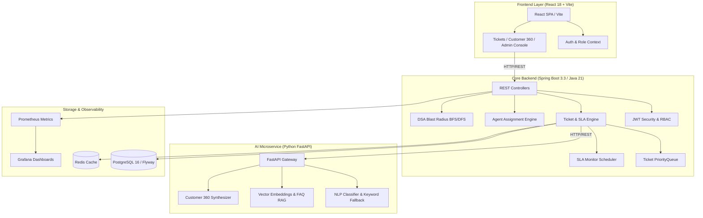

# 🚀 CloudPilot — Support Ticket Triage & SLA Monitoring Platform

[](https://github.com/sangam-builds/cloudpilot/actions/workflows/ci.yml)
[](https://cloudpilot-frontend-qfbwl7ncz-sangams-projects-d081cefb.vercel.app/login)
[](LICENSE)
[](https://render.com/deploy?repo=https://github.com/sangam-builds/cloudpilot)
[](https://vercel.com/new/clone?repository-url=https://github.com/sangam-builds/cloudpilot&root-directory=frontend)
[](https://spring.io/projects/spring-boot)
[](https://fastapi.tiangolo.com)
[](https://react.dev)
[](https://www.postgresql.org)
[](https://www.docker.com)

> 🌐 **Live Web Demo**: [https://cloudpilot-frontend-qfbwl7ncz-sangams-projects-d081cefb.vercel.app/login](https://cloudpilot-frontend-qfbwl7ncz-sangams-projects-d081cefb.vercel.app/login)  
> *Instant access with pre-seeded demo accounts (Admin, Support Agent, Customer).*

**CloudPilot** is a multi-service customer support ticket triage and SLA monitoring platform. It combines automated NLP classification and RAG draft replies with deterministic Java dispatch algorithms (multi-factor agent scoring, FIFO priority queues, and microservice dependency graph traversal for blast radius analysis).

---

## 🛠️ What I Built vs. What I Used

| Layer | Custom Implementation (What I Built) | Libraries & Infrastructure (What I Used) |
|---|---|---|
| **Dispatch & Routing** | Multi-factor agent scoring algorithm ($\mathcal{O}(n \log n)$), bounded priority queue with FIFO tie-breaking, keyword-based triage fallback engine. | Spring Boot 3.3, Java 21 standard concurrency & collections. |
| **SLA & Reliability** | Periodic SLA deadline monitor (`@Scheduled` cron), dynamic `AT_RISK` / `BREACHED` status transitions, Micrometer custom metrics. | Micrometer, Prometheus, Grafana. |
| **Incident Simulation** | Directed graph model for microservice topology, BFS/DFS blast radius traversal ($\mathcal{O}(V + E)$). | Java Collections (Adjacency List). |
| **AI & NLP** | Zero-shot classification pipeline, vector similarity FAQ retriever, customer summary synthesis. | FastAPI, SentenceTransformers (`all-MiniLM-L6-v2`), PyTorch, OpenAI API. |
| **Data & Storage** | Relational data schema, index design on query hotspots, Customer 360 aggregation service, immutable audit logger. | PostgreSQL 16, Flyway migrations, Redis & Lettuce, Spring Data JPA. |
| **Frontend & UI** | Responsive operations command center, role-based views (`ADMIN`, `AGENT`, `CUSTOMER`), interactive graph visualization. | React 18, Vite, Lucide React, CSS variables design system. |

---

## 🏛️ System Architecture



---

## 🌟 Core Subsystems & Features

### Core Subsystems

1. **Multi-Factor Agent Scoring Engine ($\mathcal{O}(n \log n)$)**:
   - Computes weighted composite scores across 4 parameters: Skill Match ($40\%$), Workload Balance ($30\%$), Customer Satisfaction Rating ($20\%$), and Immediate Availability ($10\%$).
   - Returns deterministic agent ranking with bounded priority queue fallback when agents are at capacity.

2. **SLA Scanner & Observability Pipeline**:
   - `@Scheduled` background worker scans open tickets every 60 seconds.
   - Automatically transitions tickets to `AT_RISK` when remaining time $\le 20\%$ and `BREACHED` when past deadline.
   - Publishes custom Prometheus metrics (`cloudpilot_sla_breaches_total`, `cloudpilot_sla_at_risk_total`) scraped and visualized via Grafana.

3. **Microservice Dependency Blast Radius Simulator ($\mathcal{O}(V + E)$)**:
   - Models service topologies as directed graphs using an adjacency list.
   - Uses Breadth-First Search (BFS) to compute the cascade impact and critical downstream dependencies when a service experiences an outage.

### Supporting Capabilities

- **AI NLP Triage & RAG Copilot**: Classifies category, priority, and sentiment via FastAPI microservice; falls back gracefully to Java regex heuristics if the AI service is unreachable. Vector search retrieves relevant FAQ articles to generate draft agent responses.
- **Customer 360 Aggregator**: Merges order history, lifetime customer spend, open support requests, and chronological activity timelines into a consolidated customer profile.
- **Role-Based Access Control & Audit Trail**: Stateless JWT authentication with enforced roles (`ADMIN`, `AGENT`, `CUSTOMER`) and append-only audit logging for system actions.

---

## ⚡ Quick Start (Docker Compose)

The entire multi-tier stack can be launched locally with a single command:

```bash
# Clone repository
git clone https://github.com/sangam-builds/cloudpilot.git
cd cloudpilot

# Launch all 7 containers
docker compose up --build
```

### Access URLs
| Service | URL | Notes |
|---|---|---|
| **Frontend UI** | [http://localhost:3000](http://localhost:3000) | Preset 1-click accounts on login screen |
| **Spring Boot Backend** | [http://localhost:8080](http://localhost:8080) | REST API endpoints |
| **Swagger / OpenAPI** | [http://localhost:8080/swagger-ui.html](http://localhost:8080/swagger-ui.html) | Interactive API documentation |
| **FastAPI AI Engine** | [http://localhost:8000/docs](http://localhost:8000/docs) | NLP & RAG endpoint docs |
| **Prometheus Metrics** | [http://localhost:9090](http://localhost:9090) | Application metrics scraper |
| **Grafana Dashboards** | [http://localhost:3001](http://localhost:3001) | Pre-configured dashboard (`admin` / `admin`) |

---

## 🧪 Automated Testing & Verification

### Backend Unit & Integration Tests (33/33 passing)
```bash
cd backend
mvn test
```
- Tests cover `AgentScorer`, `ServiceDependencyGraph`, `TicketPriorityQueue`, `TicketTimestampSearch`, `SlaMonitorJob`, `AssignmentService`, `CustomerService`, `TicketService`, `SlaService`, `AuthService`, and `SecurityRbac`.

### Python AI Service Tests (9/9 passing)
```bash
cd ai-service
pytest tests/ -v
```
- Tests cover zero-shot ticket classification, heuristic fallback mechanisms, RAG knowledge retrieval, threshold fallbacks, and similar ticket lookups.

### Frontend Production Build
```bash
cd frontend
npm run build
```

---

## 📚 Technical Documentation & Design Records

- 🏛️ [Architecture Decision Records (ADRs)](docs/decisions.md) — 6 design decisions covering framework selection, cache strategy, scoring weights, and scope boundaries.
- 📐 [DSA & Algorithms Deep Dive](docs/algorithms.md) — Exact mathematical formulas, step-by-step worked examples, and asymptotic complexity derivations.
- 🗄️ [Database Architecture](docs/database-design.md) — Relational schema, indexing strategy, and state transition lifecycle.
- 📖 [REST API Reference](docs/API.md) — Request/response schemas, status codes, and security requirements.
- 🎬 [Demonstration Guide](docs/demo.md) — Step-by-step evaluator walkthrough script.
- ☁️ [Deployment Guide](docs/deployment.md) — Instructions for hosting on Render, Vercel, and Neon.

---

## 📄 License
This project is licensed under the [MIT License](LICENSE).
