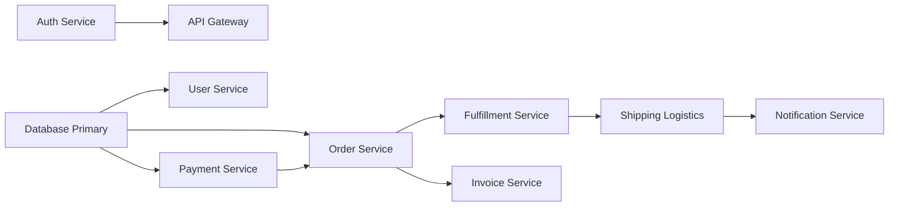

# CloudPilot — Data Structures & Algorithms (DSA) Engine

This document details the four core data structures and algorithmic routines implemented in CloudPilot, including mathematical definitions, concrete worked numeric examples, and step-by-step computational complexity derivations.

---

## 1. Weighted Multi-Factor Agent Scoring Algorithm
- **Source File**: [`AgentScorer.java`](file:///d:/cloudpilot/backend/src/main/java/com/cloudpilot/algorithms/AgentScorer.java)
- **Time Complexity**: $\mathcal{O}(n \log n)$ where $n$ is the number of candidate agents
- **Space Complexity**: $\mathcal{O}(n)$ auxiliary storage for result structures

### Mathematical Formulation
For a candidate agent $a \in A$ and incoming ticket $t$, the composite suitability score $S(a, t) \in [0.0, 1.0]$ is computed as:

$$S(a, t) = w_s \cdot S_{\text{skill}}(a, t) + w_w \cdot S_{\text{workload}}(a) + w_r \cdot S_{\text{rating}}(a) + w_a \cdot S_{\text{avail}}(a)$$

Where the fixed weights are:
- $w_s = 0.40$ (Skill Match)
- $w_w = 0.30$ (Workload Efficiency)
- $w_r = 0.20$ (Performance CSAT Rating)
- $w_a = 0.10$ (Live Availability)

$$\sum w_i = 0.40 + 0.30 + 0.20 + 0.10 = 1.00$$

#### Component Formulations:
1. **Skill Overlap Score ($S_{\text{skill}}$)**:
   $$S_{\text{skill}}(a, t) = \min\left(1.0, \; 0.30 + 0.70 \cdot \frac{|\text{Tokens}(t) \cap \text{Skills}(a)|}{|\text{Skills}(a)|}\right)$$
   *Design Rationale*: A baseline floor of $0.30$ represents baseline organizational competence, with up to $+0.70$ awarded proportionally based on matching skill tags found in the ticket's category, subject, and description.

2. **Workload Efficiency Score ($S_{\text{workload}}$)**:
   $$S_{\text{workload}}(a) = \frac{1}{1 + \max(0, \text{currentWorkload})}$$
   *Design Rationale*: A harmonic reciprocal function $\frac{1}{1 + w}$ penalizes heavily loaded agents non-linearly, ensuring high responsiveness without creating hard threshold cutoffs.

3. **Performance Rating Score ($S_{\text{rating}}$)**:
   $$S_{\text{rating}}(a) = \min\left(1.0, \; \max\left(0.0, \; \frac{\text{rating}}{5.0}\right)\right)$$

4. **Availability Bonus ($S_{\text{avail}}$)**:
   $$S_{\text{avail}}(a) = \begin{cases} 1.0 & \text{if } \text{isAvailable} = \text{true} \\ 0.0 & \text{if } \text{isAvailable} = \text{false} \end{cases}$$

### Worked Numeric Example
Consider an incoming ticket $t$ for **Payments**:
- `subject`: *"Duplicate charge on invoice"*
- `description`: *"Need immediate refund on credit card"*

Candidate Agents:
- **Agent 1 (Alex Mercer)**: Skills = `["refunds", "stripe", "invoicing", "chargebacks"]` (4 skills), Workload = `2`, Rating = `4.95`, Available = `true`.
- **Agent 2 (Sarah Connor)**: Skills = `["tax", "wire-transfers", "subscriptions"]` (3 skills), Workload = `0`, Rating = `4.80`, Available = `true`.

#### Step-by-Step Scoring:

**Agent 1 (Alex Mercer)**:
- Matching skills in ticket text: `"refunds"`, `"invoicing"` (2 matches out of 4 skills).
- $S_{\text{skill}} = 0.30 + 0.70 \cdot \left(\frac{2}{4}\right) = 0.30 + 0.35 = 0.65$
- $S_{\text{workload}} = \frac{1}{1 + 2} = \frac{1}{3} \approx 0.3333$
- $S_{\text{rating}} = \frac{4.95}{5.0} = 0.9900$
- $S_{\text{avail}} = 1.0000$
- **Total Score**:
  $$S(a_1, t) = (0.40 \times 0.65) + (0.30 \times 0.3333) + (0.20 \times 0.99) + (0.10 \times 1.00)$$
  $$S(a_1, t) = 0.2600 + 0.1000 + 0.1980 + 0.1000 = \mathbf{0.6580}$$

**Agent 2 (Sarah Connor)**:
- Matching skills in ticket text: $0$ matches out of 3 skills.
- $S_{\text{skill}} = 0.30 + 0.70 \cdot \left(\frac{0}{3}\right) = 0.3000$
- $S_{\text{workload}} = \frac{1}{1 + 0} = \frac{1}{1} = 1.0000$
- $S_{\text{rating}} = \frac{4.80}{5.0} = 0.9600$
- $S_{\text{avail}} = 1.0000$
- **Total Score**:
  $$S(a_2, t) = (0.40 \times 0.30) + (0.30 \times 1.00) + (0.20 \times 0.96) + (0.10 \times 1.00)$$
  $$S(a_2, t) = 0.1200 + 0.3000 + 0.1920 + 0.1000 = \mathbf{0.7120}$$

*Result*: Agent 2 (Sarah Connor) ranks higher ($0.7120 > 0.6580$) due to complete availability and zero current workload offsetting the domain skill gap.

### Complexity Derivation
1. **Scoring Phase**: For each of the $n$ candidate agents, computing substring token matches across $k$ skills takes $\mathcal{O}(k \cdot L)$ where $L$ is text length. With bounded $k$ and $L$, scoring all $n$ agents is $\mathcal{O}(n)$.
2. **Sorting Phase**: Sorting the $n$ scored candidates using dual-pivot quicksort/TimSort takes $\mathcal{O}(n \log n)$ comparisons.
3. **Total Time Complexity**: $\mathcal{O}(n + n \log n) = \mathcal{O}(n \log n)$.

---

## 2. Service Dependency Graph & Blast Radius Simulator
- **Source File**: [`ServiceDependencyGraph.java`](file:///d:/cloudpilot/backend/src/main/java/com/cloudpilot/algorithms/ServiceDependencyGraph.java)
- **Time Complexity**: $\mathcal{O}(V + E)$ where $V$ is the number of services, $E$ is dependency edges
- **Space Complexity**: $\mathcal{O}(V)$ for visited tracking and traversal queue/recursion stack

### Directed Graph Representation
The microservice topology is stored as an adjacency list: `Map<String, List<String>> adjacencyList`. A directed edge $u \to v$ denotes that service $v$ depends on service $u$ (i.e. if $u$ fails, $v$ experiences downstream outage).



### Worked Traversal Example (BFS)
**Target Failure**: `Payment Service` undergoes an unplanned outage.

1. **Initialization**:
   - `queue = ["Payment Service"]`
   - `visited = {"Payment Service"}`
   - `affected = []`
2. **Iteration 1**:
   - Dequeue `"Payment Service"`. Neighbors from graph: `["Order Service"]`.
   - Add `"Order Service"` to `visited` and enqueue.
   - `affected = ["Order Service"]`.
3. **Iteration 2**:
   - Dequeue `"Order Service"`. Neighbors: `["Fulfillment Service", "Invoice Service"]`.
   - Add both to `visited` and enqueue.
   - `affected = ["Order Service", "Fulfillment Service", "Invoice Service"]`.
4. **Iteration 3**:
   - Dequeue `"Fulfillment Service"`. Neighbors: `["Shipping Logistics"]`.
   - Add `"Shipping Logistics"` to `visited` and enqueue.
   - `affected = [..., "Shipping Logistics"]`.
5. **Iteration 4**:
   - Dequeue `"Invoice Service"`. Neighbors: `[]`.
6. **Iteration 5**:
   - Dequeue `"Shipping Logistics"`. Neighbors: `["Notification Service"]`.
   - Add `"Notification Service"` to `visited` and enqueue.
   - `affected = [..., "Notification Service"]`.
7. **Iteration 6**:
   - Dequeue `"Notification Service"`. Neighbors: `[]`.
8. **Queue Empty**: Traversal concludes.

**Final Impacted Blast Radius**: `["Order Service", "Fulfillment Service", "Invoice Service", "Shipping Logistics", "Notification Service"]` (5 cascading downstream failures).

### Complexity Derivation
- Every vertex (service) is enqueued and dequeued at most once: $\mathcal{O}(V)$.
- Every directed edge (dependency) leaving a visited vertex is inspected exactly once: $\mathcal{O}(E)$.
- Overall Time: $\mathcal{O}(V + E)$. Space: $\mathcal{O}(V)$ for `visited` Set and `queue`.

---

## 3. Priority Queue with FIFO Tie-Breaking
- **Source File**: [`TicketPriorityQueue.java`](file:///d:/cloudpilot/backend/src/main/java/com/cloudpilot/algorithms/TicketPriorityQueue.java)
- **Time Complexity**: $\mathcal{O}(\log N)$ push / poll, $\mathcal{O}(1)$ peek
- **Space Complexity**: $\mathcal{O}(N)$

### Comparator Definition
```java
public static final Comparator<Ticket> TICKET_COMPARATOR = (t1, t2) -> {
    int rank1 = getPriorityRank(t1.getPriority()); // HIGH=1, MEDIUM=2, LOW=3
    int rank2 = getPriorityRank(t2.getPriority());

    if (rank1 != rank2) {
        return Integer.compare(rank1, rank2); // Lower rank number = Higher priority
    }

    // Secondary Key: Creation timestamp (FIFO for equal priority)
    return t1.getCreatedAt().compareTo(t2.getCreatedAt());
};
```

### Worked Example
Suppose four tickets arrive in the following order:
1. `Ticket A`: `Priority = MEDIUM`, `CreatedAt = 10:00 AM`
2. `Ticket B`: `Priority = HIGH`, `CreatedAt = 10:05 AM`
3. `Ticket C`: `Priority = HIGH`, `CreatedAt = 10:02 AM`
4. `Ticket D`: `Priority = LOW`, `CreatedAt = 09:50 AM`

**Extraction Order via `poll()`**:
- **1st**: `Ticket C` (`HIGH`, 10:02 AM) — Highest priority rank (`1`), older than `Ticket B`.
- **2nd**: `Ticket B` (`HIGH`, 10:05 AM) — Highest priority rank (`1`), newer than `Ticket C`.
- **3rd**: `Ticket A` (`MEDIUM`, 10:00 AM) — Medium priority rank (`2`).
- **4th**: `Ticket D` (`LOW`, 09:50 AM) — Low priority rank (`3`), despite arriving earliest overall.

---

## 4. Binary Search on Sorted Incident Timestamps
- **Source File**: [`TicketTimestampSearch.java`](file:///d:/cloudpilot/backend/src/main/java/com/cloudpilot/algorithms/TicketTimestampSearch.java)
- **Time Complexity**: $\mathcal{O}(\log N)$ index lookup
- **Space Complexity**: $\mathcal{O}(1)$ auxiliary memory

### Boundary Algorithm (`findFirstIndexAtOrAfter`)
Given an array of $N$ tickets sorted chronologically by `createdAt`, find the smallest index $i$ such that $\text{tickets}[i].\text{createdAt} \ge T_{\text{target}}$.

```java
int low = 0, high = sortedTickets.size() - 1, resultIndex = -1;
while (low <= high) {
    int mid = low + (high - low) / 2;
    ZonedDateTime midTime = sortedTickets.get(mid).getCreatedAt();

    if (!midTime.isBefore(targetTime)) {
        resultIndex = mid;      // Valid candidate, check if earlier match exists
        high = mid - 1;
    } else {
        low = mid + 1;          // Must be to the right
    }
}
return resultIndex;
```

### Worked Example
Array of ticket timestamps:
`[09:00, 09:15, 09:30, 09:45, 10:00, 10:15, 10:30]` (Indices 0 to 6)
`Target Time` = `09:25`

- **Round 1**: `low = 0, high = 6` $\to$ `mid = 3` (`09:45`).
  - `09:45 >= 09:25` is True $\to$ `resultIndex = 3, high = 2`.
- **Round 2**: `low = 0, high = 2` $\to$ `mid = 1` (`09:15`).
  - `09:15 >= 09:25` is False $\to$ `low = 2`.
- **Round 3**: `low = 2, high = 2` $\to$ `mid = 2` (`09:30`).
  - `09:30 >= 09:25` is True $\to$ `resultIndex = 2, high = 1`.
- **Loop Terminated** (`low = 2 > high = 1`).
- **Result Index**: `2` (corresponding to timestamp `09:30`).

### Complexity Derivation
Each iteration halves the search space ($N \to N/2 \to N/4 \dots \to 1$).
Number of iterations $k$ satisfies $2^k \approx N \implies k = \lfloor \log_2 N \rfloor + 1$.
Thus, time complexity is strictly $\mathcal{O}(\log N)$ with $\mathcal{O}(1)$ additional memory.
