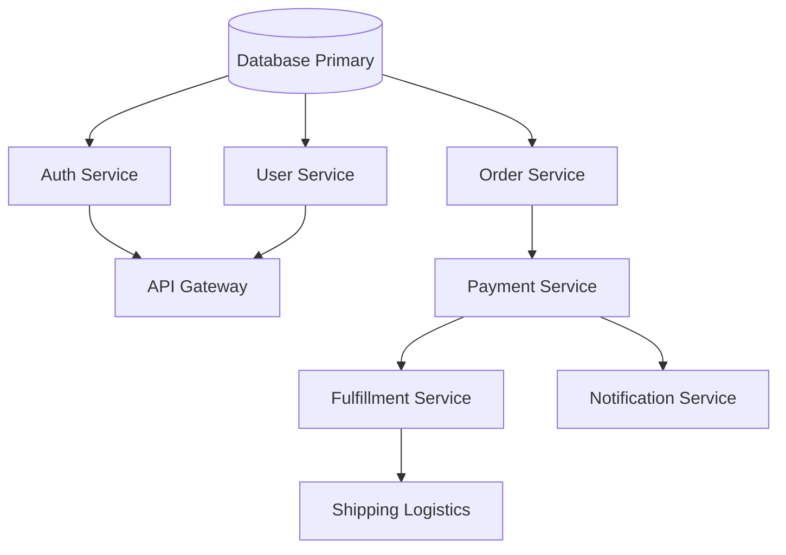

# CloudPilot — Data Structures & Algorithms (DSA) Engine

CloudPilot utilizes four core algorithms to deliver deterministic ticket routing, blast radius calculation, priority ordering, and sub-millisecond timeline lookups.

---

## 1. Weighted Multi-Factor Agent Scoring Algorithm
- **File**: `backend/src/main/java/com/cloudpilot/algorithms/AgentScorer.java`
- **Time Complexity**: $\mathcal{O}(n \log n)$ where $n$ is candidate agents
- **Space Complexity**: $\mathcal{O}(n)$

### Mathematical Formulation
For each candidate agent $a \in A$ and incoming ticket $t$, the total score $S(a, t) \in [0, 100]$ is computed as:

$$S(a, t) = w_s \cdot S_{\text{skill}}(a, t) + w_w \cdot S_{\text{workload}}(a) + w_r \cdot S_{\text{rating}}(a) + w_a \cdot S_{\text{avail}}(a)$$

Where:
- **Skill Match Score ($w_s = 0.40$)**: Jaccard-style keyword intersection between agent skill tags and ticket subject/description terms.
  $$S_{\text{skill}} = \min\left(100, \frac{|\text{Tokens}(t) \cap \text{Skills}(a)|}{3} \times 100\right)$$
- **Workload Efficiency ($w_w = 0.30$)**: Penalizes overloaded agents linearly.
  $$S_{\text{workload}} = \max\left(0, 100 - (\text{currentWorkload} \times 12.5)\right)$$
- **CSAT Rating ($w_r = 0.20$)**: Normalized from the 5-star rating scale.
  $$S_{\text{rating}} = \left(\frac{\text{rating}}{5.0}\right) \times 100$$
- **Live Availability ($w_a = 0.10$)**:
  $$S_{\text{avail}} = \begin{cases} 100 & \text{if isAvailable = true} \\ 0 & \text{if isAvailable = false} \end{cases}$$

### Ranking & Tie Breaking
Candidates are sorted in descending order of $S(a, t)$. In the event of a tie ($|S(a_1, t) - S(a_2, t)| < 10^{-6}$), the tie is broken by comparing `currentWorkload` (favoring lower load), followed by `id` for deterministic output.

---

## 2. Service Dependency Graph & Blast Radius Simulator (BFS / DFS)
- **File**: `backend/src/main/java/com/cloudpilot/algorithms/ServiceDependencyGraph.java`
- **Time Complexity**: $\mathcal{O}(V + E)$ where $V$ is services, $E$ is dependency edges
- **Space Complexity**: $\mathcal{O}(V)$ for visited set and queue/recursion stack

### Directed Graph Topology

### Graph Traversal Implementations
- **Breadth-First Search (BFS)**: Uses a `ArrayDeque<String>` and `HashSet<String>` visited tracking to compute layer-by-layer dependency blast radius.
- **Depth-First Search (DFS)**: Recursive traversal identifying long cascading failure chains.
- **Cycle Detection**: Topological validation ensuring acyclic microservice dependencies.

---

## 3. Priority Queue with FIFO Tie-Breaking
- **File**: `backend/src/main/java/com/cloudpilot/algorithms/TicketPriorityQueue.java`
- **Time Complexity**: $\mathcal{O}(\log N)$ push/pop, $\mathcal{O}(1)$ peek
- **Space Complexity**: $\mathcal{O}(N)$

### Priority Comparator Logic
Tickets waiting for agent capacity are held in a bounded binary min/max heap (`java.util.PriorityQueue`):
1. **Primary Key**: Priority level numeric rank (`HIGH = 3`, `MEDIUM = 2`, `LOW = 1`). Higher rank departs earlier.
2. **Secondary Key**: Earliest creation timestamp (`createdAt.compareTo(other.createdAt)`), preserving strict FIFO fairness among identical priorities.

---

## 4. Binary Search on Sorted Incident Timestamps
- **File**: `backend/src/main/java/com/cloudpilot/algorithms/TicketTimestampSearch.java`
- **Time Complexity**: $\mathcal{O}(\log N)$ search time, $\mathcal{O}(N \log N)$ initial sorting
- **Space Complexity**: $\mathcal{O}(1)$ auxiliary

### Range Search
Allows sub-millisecond querying of tickets created within any target time window $[T_{\text{start}}, T_{\text{end}}]$ across historical datasets by locating exact boundary indices:
- `findFirstAfter(target)`: $\mathcal{O}(\log N)$ lower-bound binary search.
- `findLastBefore(target)`: $\mathcal{O}(\log N)$ upper-bound binary search.
