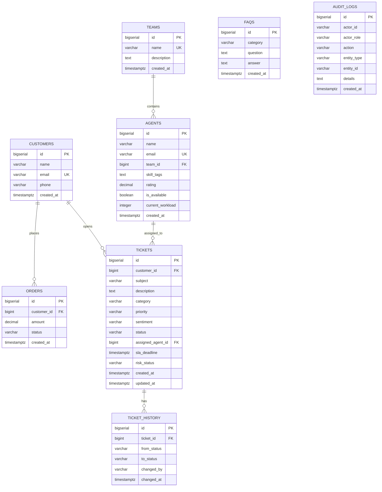
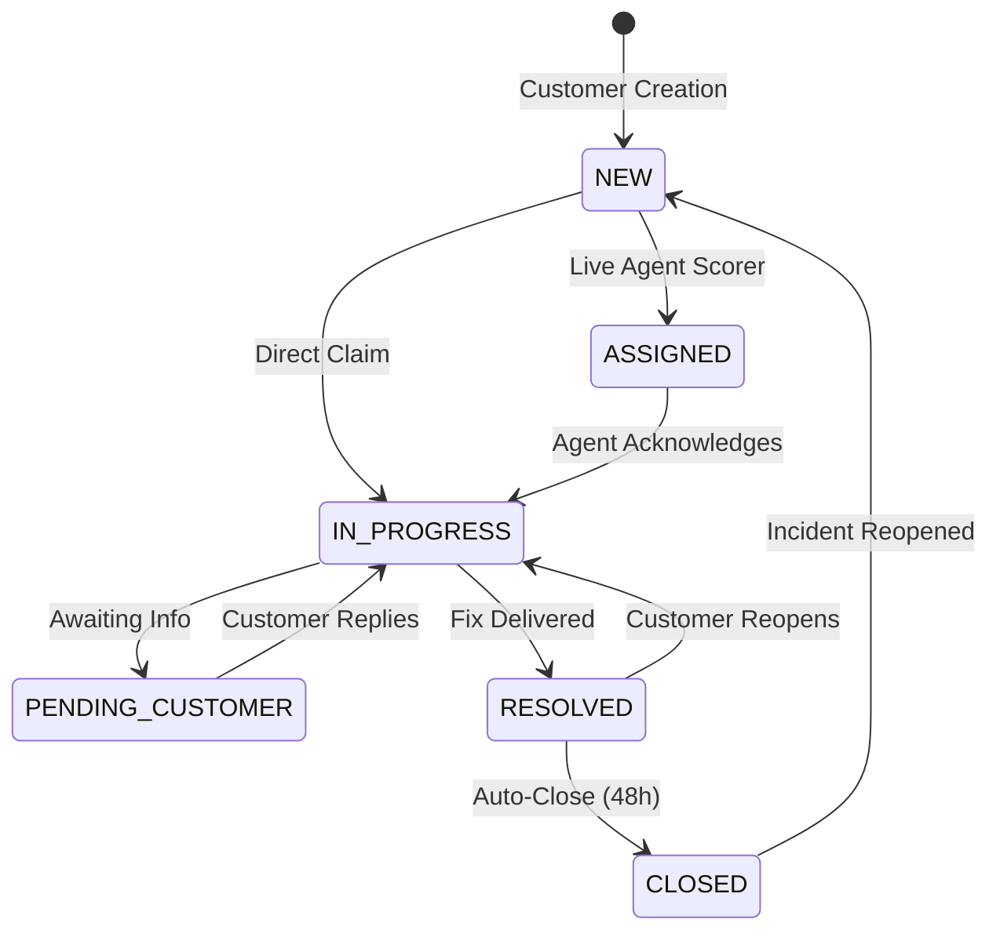

# CloudPilot — Database Architecture & Schema Design

CloudPilot is designed to run against enterprise-grade cloud PostgreSQL instances (e.g. **Neon**, **Supabase**, **Render**, or **AWS RDS**) with SSL encryption, Flyway schema migrations, and HikariCP connection pooling.

---

## 📐 Entity-Relationship (ER) Diagram



---

## 🗄️ Indexing & Performance Strategy

| Table | Index Columns | Type | Purpose |
|---|---|---|---|
| `tickets` | `(status)` | B-Tree | High-speed filtering on active vs closed tickets |
| `tickets` | `(priority)` | B-Tree | PriorityQueue queries and triage analytics |
| `tickets` | `(customer_id)` | B-Tree | Instant Customer 360 relation lookups |
| `tickets` | `(risk_status, sla_deadline)` | Composite | Real-time SLA monitor scanning and alerting |
| `audit_logs` | `(entity_type, entity_id)` | Composite | Fast audit trail retrieval per ticket or customer |
| `agents` | `(team_id, is_available)` | Composite | Rapid candidate filtering for agent scoring |

---

## 🔄 Ticket Status State Machine



---

## ☁️ Cloud Database Configuration

To connect CloudPilot to a cloud PostgreSQL provider, configure the datasource environment variables:

```properties
# Cloud Connection String with SSL
SPRING_DATASOURCE_URL=jdbc:postgresql://ep-silent-pool-12345.us-east-2.aws.neon.tech/cloudpilot?sslmode=require
SPRING_DATASOURCE_USERNAME=cloudpilot_owner
SPRING_DATASOURCE_PASSWORD=your_secure_cloud_password

# Flyway Migration Controls
SPRING_FLYWAY_ENABLED=true
SPRING_FLYWAY_BASELINE_ON_MIGRATE=true
```
Flyway automatically applies `V1__init_schema.sql` and `V2__seed_data.sql` during Spring Boot startup.
